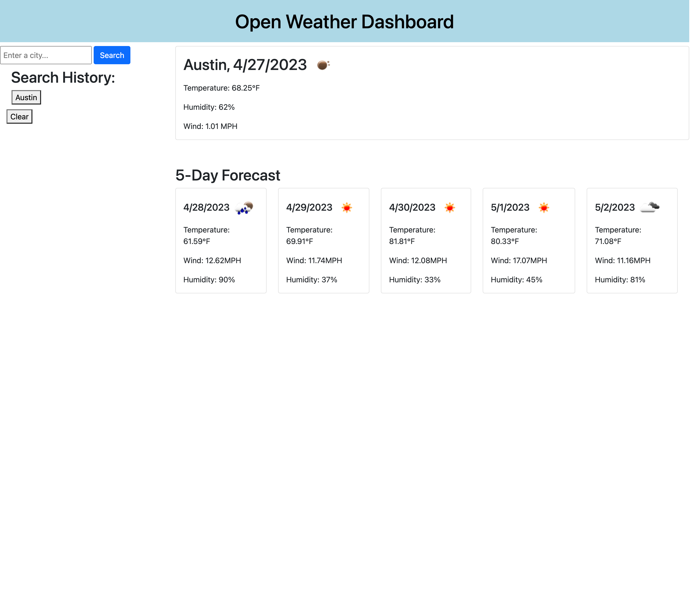

# Open Weather Dashboard

## Description
Planning a vacation? Need to know what the weather is like several days in advance before making your decision to travel? Introducing Open Weather Dashboard. Based on the Open Weather API, the Open Weather Dashboard application will give you the current weather data, as well as a 5-day weather forecast, for cities in the United States. 

Most weather applications contain complicated user-interfaces, with bloated featureware. While the average person is intimately familiar with consumer technology, some elderly populations around the world, who did not grow up with computers, nor wished to assimilate with a technological society, may experience information overload or frustration navigating modern websites.  With this application, getting the information you need is one click away, without the distraction of many surrounding features/UIs. Building this application reinforces jQuery concepts, for loops, event delegation, localStorage, conditional statements, fetch API, and server-side API techniques. 

## Usage

1. Click the text-input field.
2. Type a city name in the United States.
3. Click Search
4. Click the Clear button, if you wish to clear your search history. 

Access the application here: https://lyubomirg1995.github.io/weather-dashboard/

;

## Credits

HTML structure, lines 31-76; JS variable assignment, lines 1-14: https://www.youtube.com/watch?v=bCymBWY1UC0&t=147s;

Current + 5-day forecast console data, lines 17-68: AskBC Learning Assistants: seanbbyfield and talexander (direct code solutions), https://openweathermap.org/forecast5;

Unix time-conversion, lines 81-82: https://stackoverflow.com/questions/5416920/timestamp-to-human-readable-format

Icon display, lines 92-94, 130-131: https://stackoverflow.com/questions/44177417/how-to-display-openweathermap-weather-icon, GTP-4 (direct code solution)

for loop setup, line 75: GTP-4 tutor prompt (NO direct code solution);

localStorage debugging, lines 137-160, 168-179, 181: GTP-4 (direct code solution);

Display current + future weather data from search history, lines 188-191: GTP-4 tutor prompt (NO direct code solution);

Clear history, lines 193-197: GTP-4 (direct code solution);

